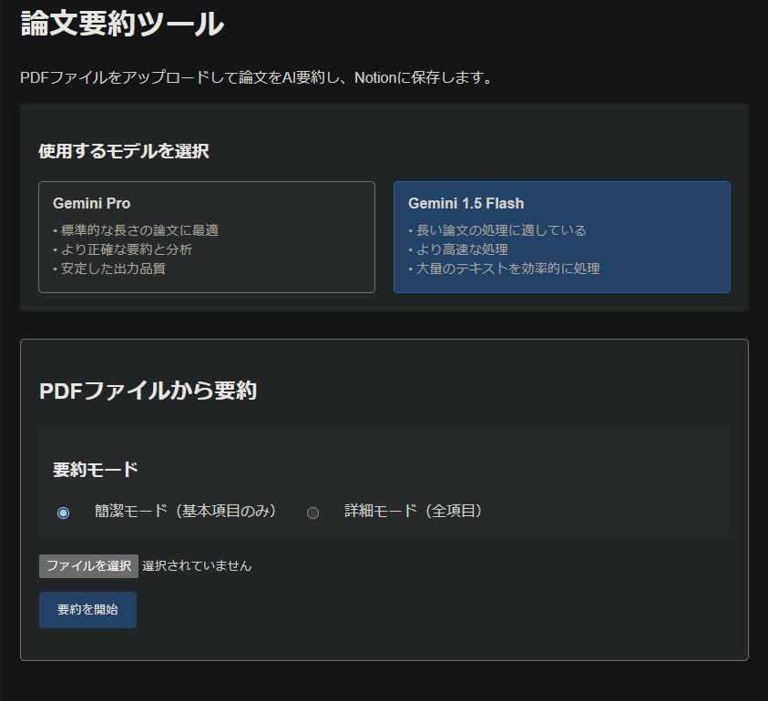

# Paper Summarizer | 論文要約ツール

[English](#english) | [日本語](#japanese)



<div style="display: flex; gap: 10px; margin: 20px 0;">
    
    
</div>

<a id="english"></a>
# Paper Summarizer

A tool to automatically summarize academic papers and save summaries to Notion.

## Features
- Automatic summarization of PDF papers
- Save summaries to specified Notion database
- Powered by Google Gemini 1.5 Pro / Gemini 1.5 Flash
- Japanese summary output for English papers

## Requirements
- Python 3.9
- Notion database with "Name" column (if your database has a "名前" column, please rename it to "Name")

## Setup

### 1. Get Required API Keys

#### Notion API Setup
1. Visit [Notion Integrations](https://www.notion.so/my-integrations)
2. Click "New Integration"
3. Create integration with desired name
4. Save the "Internal Integration Token"

#### Notion Database Preparation
1. Create a new database in Notion
2. Go to "..." → "Connections" in database settings
3. Add the integration you created
4. Get database ID from URL:
   ```
   https://www.notion.so/xxxxx?v=yyyy
   (xxxxx is your database ID)
   ```

#### Google API Key
1. Visit [Google AI Studio](https://makersuite.google.com/app/apikey)
2. Create and save API key

### 2. Installation

```bash
# Clone repository
git clone https://github.com/docto-rin/paper_summarizer
cd paper_summarizer

# Install dependencies
pip install -r requirements.txt

# Setup environment variables
cp .env.example .env
```

### 3. Configure Environment Variables
Edit `.env` file:

```env
GOOGLE_API_KEY=your_google_api_key
NOTION_API_KEY=your_notion_api_key
NOTION_DATABASE_ID=your_database_id
```

### 4. Run Application

```bash
uvicorn src.main:app --reload
```

Access http://127.0.0.1:8000 to start using the tool

## Usage
1. Access web interface
2. Select model (Gemini 1.5 Pro or Gemini 1.5 Flash)
3. Upload PDF file
4. Click "Start Summary"
5. Results will be saved to your Notion database

## Notes
- Only supports English academic papers
- Summaries are generated in Japanese
- Ensure proper database permissions in Notion

## Advanced Usage
### Edit and rename service configuration
   ```bash
   # Make a copy of example files
   cp paper-summarizer.service.example paper-summarizer.service
   cp start_server.sh.example start_server.sh
   
   # Edit the service file to match your environment
   # - Update User and Group to your username
   # - Modify WorkingDirectory to match your installation path
   nano paper-summarizer.service
   
   # Edit the start script to match your environment
   # - Update paths and environment variables as needed
   nano start_server.sh
   
   # Make start script executable
   chmod +x start_server.sh
   ```

### Setting up Log Directory
   ```bash
   sudo mkdir -p /var/log/paper-summarizer
   sudo chown -R $USER:$USER /var/log/paper-summarizer
   sudo chmod 755 /var/log/paper-summarizer
   ```

### Running as a System Service
1. Copy the service file:
   ```bash
   sudo cp paper-summarizer.service /etc/systemd/system/
   ```
2. Reload systemd manager configuration:
   ```bash
   sudo systemctl daemon-reload
   ```
3. Start the service:
   ```bash
   sudo systemctl start paper-summarizer
   ```
4. Enable the service to start on boot:
   ```bash
   sudo systemctl enable paper-summarizer
   ```

### Network Access Setup
To allow access from any device on your local network:

1. Open port 50000 in firewall:
```bash
sudo ufw allow 50000/tcp
```
   This allows access from any device on your local network.

2. Access the tool using:
```
http://<server-ip>:50000
```
   Replace <server-ip> with your server's IP address on the local network.

### Checking Logs
To check the logs of the service, use:
```bash
# Access Log
sudo tail -f /var/log/paper-summarizer/access.log

# Error Log
sudo tail -f /var/log/paper-summarizer/error.log
```

---

<a id="japanese"></a>
# 論文要約ツール

PDFファイルをアップロードして論文を自動要約し、Notionに保存するツールです。

## 機能
- PDFファイル形式の論文を自動要約
- 要約結果をNotion上の指定データベースに自動保存
- Google Gemini 1.5 Pro / Gemini 1.5 Flash による要約生成
- 英語論文を日本語で要約

必要要件

- Python 3.9
- Notionデータベースの初期列名が「Name」であること（「名前」となっている場合は「Name」に変更してください）

## セットアップ手順

### 1. 必要なAPIキーの取得

#### Notion APIのセットアップ
1. [Notion Integrations](https://www.notion.so/my-integrations)にアクセス
2. 「New Integration」をクリック
3. 任意の名前を入力して統合を作成
4. 表示された「Internal Integration Token」を保存

#### Notionデータベースの準備
1. Notionで新しいデータベースを作成
2. データベースの右上メニューから「...」→「Connections」を選択
3. 先ほど作成した Integration を追加
4. データベースのURLからデータベースIDを取得
   ```
   https://www.notion.so/xxxxx?v=yyyy
   ※ xxxxxの部分がデータベースID
   ```

#### Google API Keyの取得
1. [Google AI Studio](https://makersuite.google.com/app/apikey)にアクセス
2. APIキーを作成・保存

### 2. 環境構築

```bash
# リポジトリのクローン
git clone https://github.com/docto-rin/paper_summarizer
cd paper_summarizer

# 必要なパッケージのインストール
pip install -r requirements.txt

# 環境変数の設定
cp .env.example .env
```

### 3. 環境変数の設定
`.env`ファイルを以下のように編集:

```env
GOOGLE_API_KEY=your_google_api_key
NOTION_API_KEY=your_notion_api_key
NOTION_DATABASE_ID=your_database_id
```

### 4. 起動方法

```bash
uvicorn src.main:app --reload
```

ブラウザで http://127.0.0.1:8000 にアクセスして利用開始

## 使用方法
1. Webインターフェースにアクセス
2. 使用するモデルを選択（Gemini 1.5 Pro または Gemini 1.5 Flash）
3. PDFファイルをアップロード
4. 「要約を開始」をクリック
5. 処理完了後、Notionデータベースに要約結果が保存される

## 注意事項
- PDFファイルは英語論文のみ対応
- 要約結果は日本語で出力
- Notionのデータベース権限設定を確認すること

## 上級者向け利用方法
### サービス設定ファイルの編集とリネーム:
   ```bash
   # 設定ファイルのコピー
   cp paper-summarizer.service.example paper-summarizer.service
   cp start_server.sh.example start_server.sh
   
   # サービスファイルを環境に合わせて編集
   # - UserとGroupを実行ユーザー名に変更
   # - WorkingDirectoryをインストールパスに合わせる
   nano paper-summarizer.service
   
   # 起動スクリプトを環境に合わせて編集
   # - パスや環境変数を必要に応じて修正
   nano start_server.sh
   
   # 起動スクリプトに実行権限を付与
   chmod +x start_server.sh
   ```

### ログディレクトリの設定
   ```bash
   sudo mkdir -p /var/log/paper-summarizer
   sudo chown -R $USER:$USER /var/log/paper-summarizer
   sudo chmod 755 /var/log/paper-summarizer
   ```

### システムサービスとして実行
1. サービスファイルをコピー:
   ```bash
   sudo cp paper-summarizer.service /etc/systemd/system/
   ```
2. systemdマネージャーの設定をリロード:
   ```bash
   sudo systemctl daemon-reload
   ```
3. サービスを開始:
   ```bash
   sudo systemctl start paper-summarizer
   ```
4. ブート時にサービスを有効化:
   ```bash
   sudo systemctl enable paper-summarizer
   ```

### ネットワークアクセスの設定
ローカルネットワーク上の任意のデバイスからアクセスできるようにするには:

1. ポート50000を開く:
```bash
sudo ufw allow 50000/tcp
```
   これにより、ローカルネットワーク上の任意のデバイスからアクセスが可能になります。

2. 以下のURLでアクセス:
```
http://<server-ip>:50000
```
   <server-ip>の部分は、ローカルネットワーク上のサーバーのIPアドレスに置き換えてください。

### ログの確認
サービスのログを確認するには、以下を使用:
```bash
# アクセスログの確認
sudo tail -f /var/log/paper-summarizer/access.log

# エラーログの確認
sudo tail -f /var/log/paper-summarizer/error.log
```
